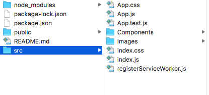

# first-github-team-sandbox

urbanSpectra core team:
- react and express devs: trainers and professionals, led by Simeon Calixte
- git and github (workflow analytics and social learning):  trainers and professionals, led by Sophie Chown
- financial services operations security and app dev, led by Jeremy Donson
- academic librarians: teams of professors and curriculum/assessment designers, led by Erica Eynouf
- radio, tv and live venue managers: collaborative promo, lead by Gordon Politnick
- sponsorship engineers: 

## Three levels to git/github skills:
- [ ]: solo local
  - Non-Coder
  - Coder
  - Trainer
- [ ]: solo remote
  - Non-Coder
  - Coder
  - Trainer
- [ ]: team remote
  - Non-Coder
  - Coder
  - Trainer

## Three levels to react/express skills:
- [ ]: react debugging
  - Coder
  - Trainer
- [ ]: react ui
  - Coder
  - Trainer
- [ ]: react state and crud
  - Coder
  - Trainer

# TEST CASE AND RUN META-DATA:

## TEST CASE METADATA:
- test case id:
- test case name:
- test tool:
- case designer:

## TEST RUN METADATA:
- test-runner:
- system:
- test-conditions:
- timestamp:
- expected:
- actual:
- outcome:
- screenshot:
- reproducible:

## The root app directory for react and express:
* 
1. App.css
2. public/
3. node_modules/
4. package-lock.json
5. package.json
6. README.md
7. src/

## Sections of the App.js file:
1. imports
2. main class
3. constructor
4. pre-render
5. render
6. export

## React bugs to kill:
1. get bug  /name/bilbo/baggins
2. 404 bug
3. absolute path issue
4. import images
5. import components
6. heroku deploy bug
7. express deploys
8. react and express => docker
9. deploy to gcloud
10. redis + csv

# Meeting Agenda
* Tasks Below
* Trading Terms
* Action Items
* First vcurrency discussion
* [fingerprint auth](https://www.washingtonpost.com/news/the-switch/wp/2018/01/12/the-tech-to-embed-a-fingerprint-reader-inside-a-screen-arrived-at-ces-but-only-in-a-chinese-phone-for-now/?utm_term=.2da75766911e)

# Next Tasks
1. [test this before promoting](http://xyc.github.io/react-inspector/)
2. [Node Debugging](http://xyc.github.io/react-inspector/)
3. [node memory stuff](https://blog.codeship.com/understanding-garbage-collection-in-node-js/)
4. [more node memory stuff](http://jayconrod.com/posts/55/a-tour-of-v8-garbage-collection)
5. [we want more than just globals](https://stackoverflow.com/questions/31173473/list-all-global-variables-in-node-js)
6. [Absolute Paths](https://spin.atomicobject.com/2017/10/07/absolute-paths-javascript/)
7. [Testing With Selenium](https://christopher.su/2015/selenium-chromedriver-ubuntu/)
8. [frameworks bult atop of selenium](http://galenframework.com/docs/about/)
9. [csv2json](https://www.npmjs.com/package/csv2json)
10. [json2csv](https://www.npmjs.com/package/json2json)
11. [redis node package](https://redislabs.com/lp/node-js-redis/)
12. [review deploy2surge](http://surge.sh)
13. [review deploy2heroku](http://www.heroku.com)
14. [deploy2tectonic](http://www.tectonic.com)

# Further Steps
* Node debugging
* Express.js
* React-Native
* React-Redux
