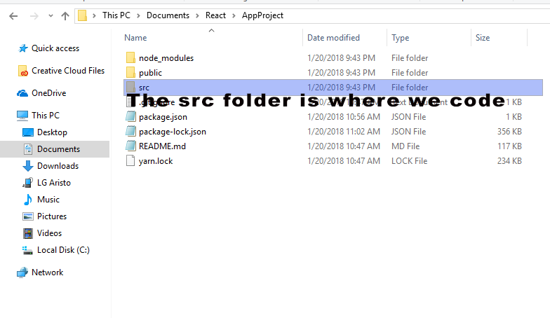

# Start Developing with React on Windows OS

Author: Calixte S.

Email Address: simeoncalixte@gmail.com

Estimated Time to Complete: 10 minutes.

>>React is one of the hottest languages currently floating around in the app development
world and sometimes just figuring out where to start with a new language can be tiring and confusing. 
So to save you the pain I am  documenting my exprience with React, listing successful paths to using React and
its marrying parts on Windows OS step by step. Other operating systems steps may vary so be cautious.


###Lets get started
----

What is needed?

1.[Git-Bash for windows](http://gitforwindows.org) here. This allows you to do more linux-y things.

2.[Scoop](http://scoop.sh/) is a package manager.
..* At this link you will be informed to run this line of code in Windows Power-shell:

```
.iex (new-object net.webclient).downloadstring('https://get.scoop.sh')
```


3. We will use scoop to install node.js 
	Run this line of code in your CLI

```
 scoop install node
```

this inturn will install npm (node package manager).


Now all the parts are availabe to us lets install React

1. Run this code in your CLI

```
 create-react-app [AppPath]
```
At this point you should be able to navigate into your app's root folder and should see the following files.



2. Move into the [AppPath] Directory from your CLI
```
 cd [AppPath]

```

To begin coding go to the src/ folder


3. Finally we start the react app, it should start the app automatically, if not; 
enter Localhost:3000 onto your internet browser.
```
npm start  (!important must be called within the App Folder)
```


------------------------------------------------------------


##Our next lesson we will explore how reacts render its pages and file structure.
##Also introduction to Components and props.